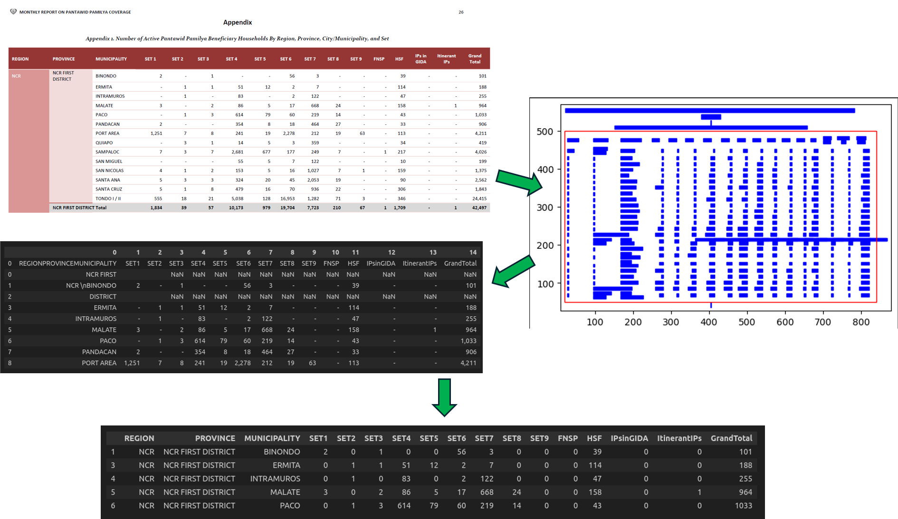
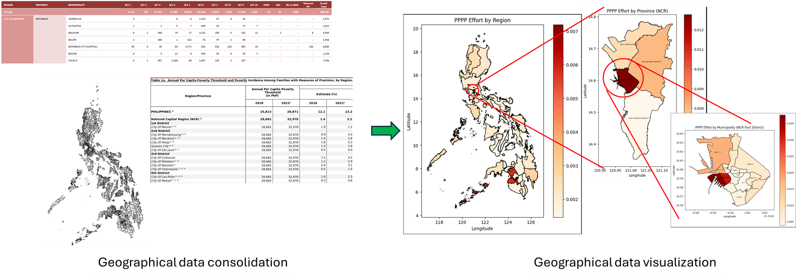
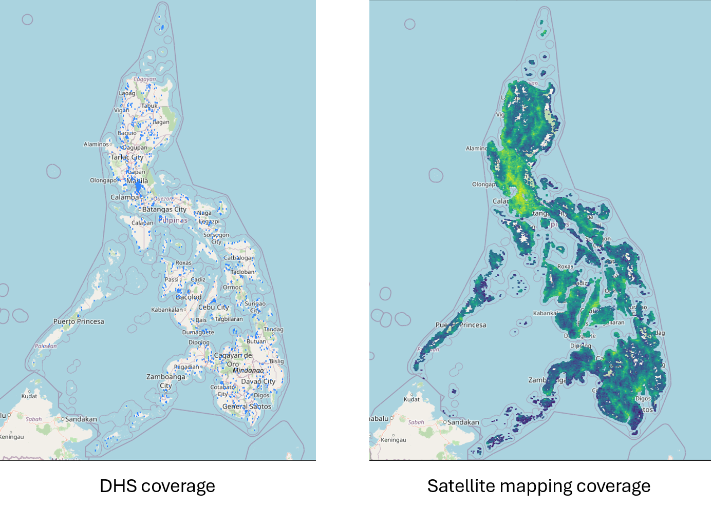

# Poverty Mapping for Impact Evaluation &ndash; A Computer Vision and Machine Learning Approach

## Overview
Geographical data from satellite imagery and other mapping sources are rich in information, making them invaluable for predictive modeling and mapping. One notable use case of such data is the prediction of wealth and poverty levels, which can simplify data collection processes and enable faster policy evaluation and implementation.

__In this project, we adopt, expand, and explore past methodology for poverty mapping as a means to evaluating public policy effectiveness__.

Here, we focus on the assessment of the Pantawid Pamilyang Program Pilipino (PPPP), a flagship program of the Philippine government to address the poverty situation in the country.

__The author wishes to emphasize that this is an academic exercise aimed at demonstrating how machine learning approaches can be integrated into policy impact evaluation. The analysis presented is intentionally simplistic, and any conclusions drawn should be considered illustrative rather than definitive.__

## Data
This project makes use of __Geo-Temporal data__ including:
- _Geographical boundaries_ - of regions, provinces, and municipalities
- _PPPP data_ - Number of households enrolled in the program
- _Wealth index_ - Wealth information from surveys representing ground truth for training
- _Poverty incidence and population density_ - Number of households living under the poverty line
- _Satellite data_ - Day time satellite images and nightlight values
- _Physical features and amenities_ - Proximity to schools, markets, roads, etc
- _Internet and mobile data usage_
    
All data used in this project are open-source, although some may not be free for us to share. Where appropriate, instructions or links for accessing these datasets will be provided.

## Project Organization
The work is presented in three notebooks:

1. `data_pppp_PI_geobounds.ipynb` - This notebook produces the geographical distribution of enrolled PPPP households, normalized by the estimated population living under the poverty line. In short, it gives the 'PPPP effort' relative to the amount of poverty at a given location. The PPPP data, i.e. number of households enrolled PPPP, is extracted from tables spread across multiple PDF reports. Other data gathered here includes geographical boundaries, population density, and poverty incidence.

2. `data_sat_img_map_feat.ipynb` - This notebook compiles the data needed for model training and prediction. This includes the wealth index to be predicted, and the various features used for prediction. The process relies heavily on ThinkingMachines open source codes to systematically collect most of the required data, and QGIS for cloudfree daytime satellite images.

3. `poverty_mapping_pppp.ipynb` - This is the current notebook. This notebook focuses on building the model using the data gathered in `data_sat_img_map_feat.ipynb` above. The poverty levels for the entire country from 2020 to 2023 is mapped using the final model here. The mapped poverty values are analysed in the context of the 'PPPP effort' derived from `data_pppp_PI_geobounds.ipynb` above, to assess the effectiveness of the PPPP in alleviating poverty.

It is recommended to read/run them in the order given above.

#### Setup: `data_sat_img_map_feat.ipynb`

We use ThinkingMachines codes heavily (with minor adaptations) in this notebook. As the ThinkingMachines codes appear to rely on older versions of certain packages, we recommend isolating the environment used for this notebook from the environment used for the other notebooks. The requirements are given in `requirements_TM.txt`. To install the required ThinkingMachine codes:

`!pip install git+https://github.com/thinkingmachines/unicef-ai4d-poverty-mapping.git`

Kudos to ThinkingMachines for their awesome code and contributions to public good!

#### Setup: `data_pppp_PI_geobounds.ipynb` and `poverty_mapping_pppp.ipynb`

Please refer to `requirements.txt` for the installation requirements.

## Highlights

### PDF Table Extraction with Camelot
Extracting tables from PDFs presents inherent challenges due to inconsistent formatting, varying table structures, and unstandardized layouts across documents. In such scenarios, having strong skills in Python and open-source tools like Pandas and Camelot is essential for effectively transforming unstructured data into usable formats.

### Geodata Extraction and Consolidation
Manipulating and extracting geospatial data necessitates familiarity with various GIS techniques and methods, such as knowledge of coordinate reference systems (CRS), open-source tools, and datasets. In this context, we gather and integrate information on population (High Resolution Settlement Layer), nightlight data (Earth Observation System), internet and mobile usage (OOKLA), public amenities (OpenStreetMap), daytime satellite imagery (EOX Sentinel-2 via QGIS WMS), and PPPP enrollment rates, among other sources, translating them from tabular to geo-data.

### Machine and Deep Learning for Poverty Mapping
Computer vision techniques (Vision Transformer, ViT) were used to extract relevant wealth related information from satellite images, while Gradient Boosting Machines (GBM) were used to map poverty levels. This is the main goal of such projects, which can dramatically increase response time and reduce costs (surveys can cost up to [1.5M USD](https://aiforsocialgood.github.io/icml2019/accepted/track1/pdfs/7_aisg_icml2019.pdf)).

